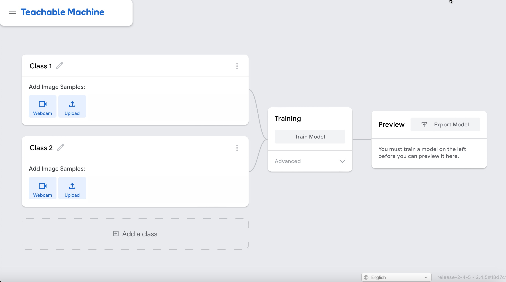
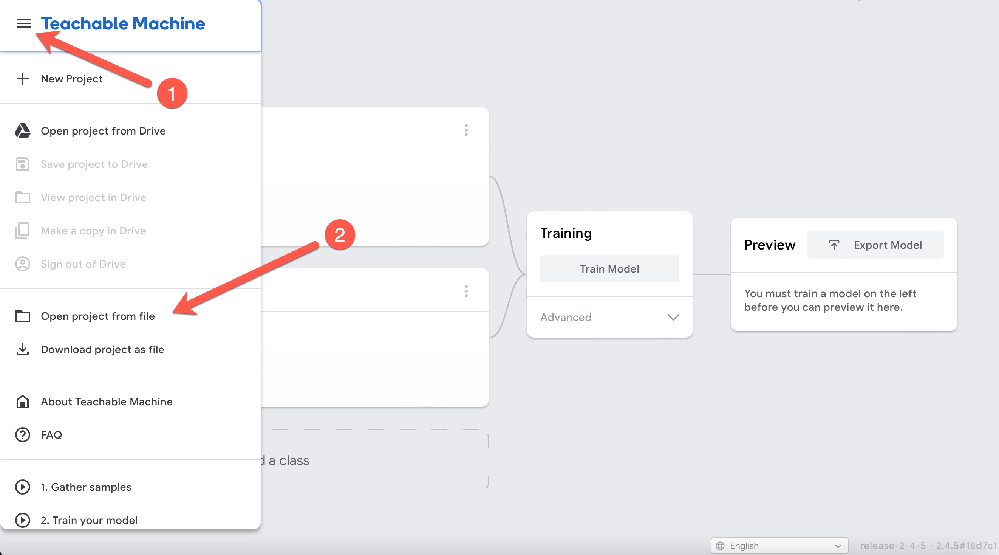
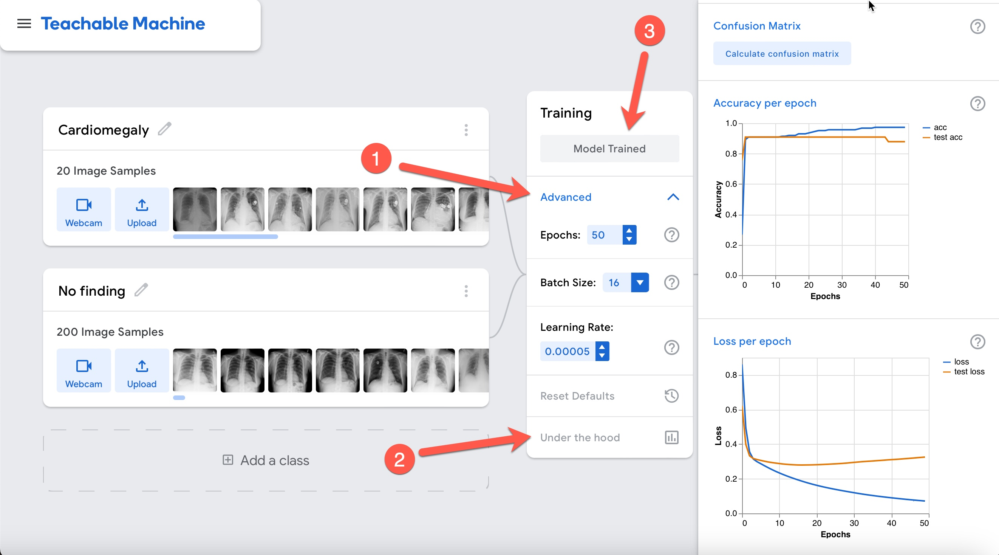
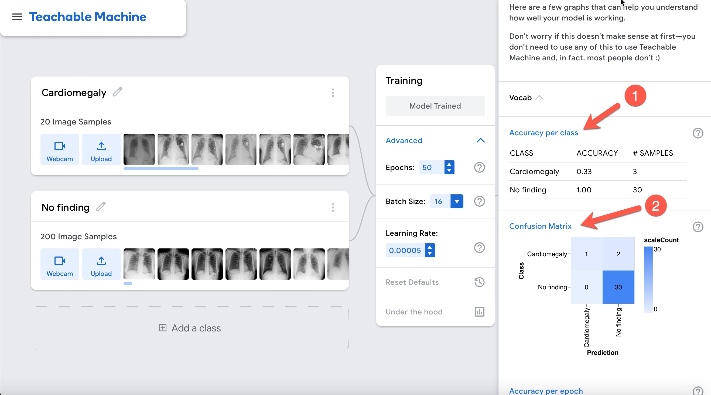
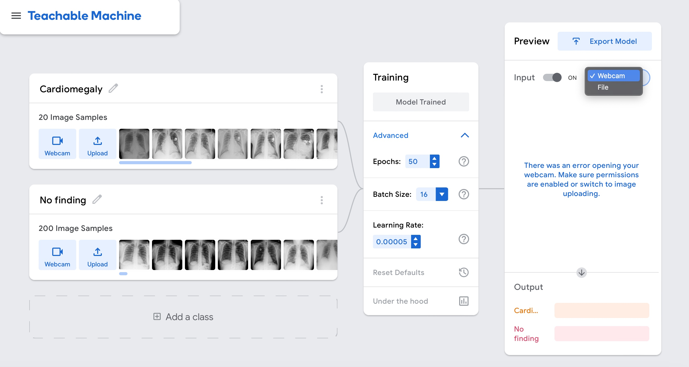

# RSNA Spotlight 2023

## AI Implementation: Building Expertise and Influence.

## Acknowledgements

The medical images for this session (chest x-rays) were obtained from: Wang X, Peng Y, Lu L, Lu Z, Bagheri M, Summers RM. ChestX-ray8: Hospital-scale Chest X-ray Database and Benchmarks on Weakly-Supervised Classification and Localization of Common Thorax Diseases. IEEE CVPR 2017 and available [here](https://www.nih.gov/news-events/news-releases/nih-clinical-center-provides-one-largest-publicly-available-chest-x-ray-datasets-scientific-community).

## Basics of Image Classification
In the field of radiology, one of the most commmon tasks is the interpretation of chest X-rays. This task, at its core, is image classification.

### How Convolutional Neural Networks (CNNs) work
To aid in this classification task with the use of computers, we will introduce a Convolutional Neural Network (CNN), a type of neural network that is specially good in recognizing patterns and objects in images, much like a team of specialized radiology trainees.

### Layers of the CNN
#### Convolutional Layers:
Imagine that each of these specialized radiology trainees focuses in identifying certain features in the X-ray. One might be proficient at noticing abnormalities in the cardiomediastinal contour, another at discerning variations in lung textures, and another at spotting abnormalities in the bone. Their observations are like looking at the X-ray through 'special lenses' or in the case of a CNN: filters.

#### Pooling Layers:
Now imagine that each of the previous trainees are providing information to a second more senior trainee that takes the detailed observations and summarizes them. If the first trainee notes several areas of abnormal lung texture with opacification of the inferolateral portion of one lung, the second trainee could summarize this as "lung opacity" and "blunting of the costophrenic angle". The process of summarization of the observations is done by the pooling layers in the CNN.

#### Fully Connected Layers:
Finally, a senior trainee considers these summarized notes and forms a preliminary diagnosis, such as "pneumonia" and "plaural effusion". This process of mapping findings or observations to a pre-defined set of labels or diseases is done by the fully connected layer in the CNN.

### Training the Network (Backpropagation and Gradient Descent)
The trainees are shown a vast number of chest X-rays already diagnosed by expert radiologists - this 'labeled data' forms their training material.

In the same way an expert radiologist points out the errors of a trainee, when a CNN makes an incorrect preliminary diagnosis, there are mechanism (i.e. backpropagation and gradient descent) that help the network adjust its approach to maximize correct responses. This process is performed iteratively and since there are so many different starting points and potential solutions, each training run might identify different optimal paths. This randomness results in diverse solutions that the CNN can use to diagnose X-rays accurately. However, once a solution is identified (the final weights of the network), as long as we keep the network configuration the same, we can expect the same high level of performance each time we use it.

## Experiments

For this session we will use Teachable Machine, a web-based tool created by Google that allows users to easily create machine learning models without needing any specialized knowledge, programming or advanced hardware.

To load Teachable machine right click on the link [here](https://teachablemachine.withgoogle.com/train/image) and choose "Open in a new tab" (or hold CTRL key + left mouse click). Please keep the two tabs open.

You should see this website:

Download the file for experiment 1 here: [experiment 1](https://github.com/lprevedello/RSNA-Spotlight-2023/raw/main/experiments/experiment1.tm)
Save this file somewhere you can locate later, it will be needed in the next step.

Click on the left upper corner and "Open project from file" to load your first experiment.

Upload the experiment1.tm file and wait for it to load. You should see the following page (please ensure the headings match):

Next, click on (1) Advanced to expand additional options, (2) Under the Hood to show real-time model training performance and (3) Train Model to start training your model.

Accuracy is very high as shown in the graph above. However, is the model really performing well? Let's interpret the results by clicking on the "Accuracy per class" and "Confusion matrix" buttons.

Notice how poor performance actually is! This discrepancy relates to the unbalanced nature of the data. Notice that there are 10 times more normals than cases of cardiomegaly. If the modelgesses everything normal it would be 80% accurate despite being of no help at all. Be careful with accuracy in unbalanced data scenarios!

Let's see how things change if we make the dataset balanced.

Download the file for experiment 2 here: [experiment 2](https://github.com/lprevedello/RSNA-Spotlight-2023/raw/main/experiments/experiment2.tm)
Save this file somewhere you can locate later, it will be needed in the next step.

Click on the left upper corner and "Open project from file" to load your first experiment.

Upload the experiment1.tm file and wait for it to load. You should see the following page (please ensure the headings match):

